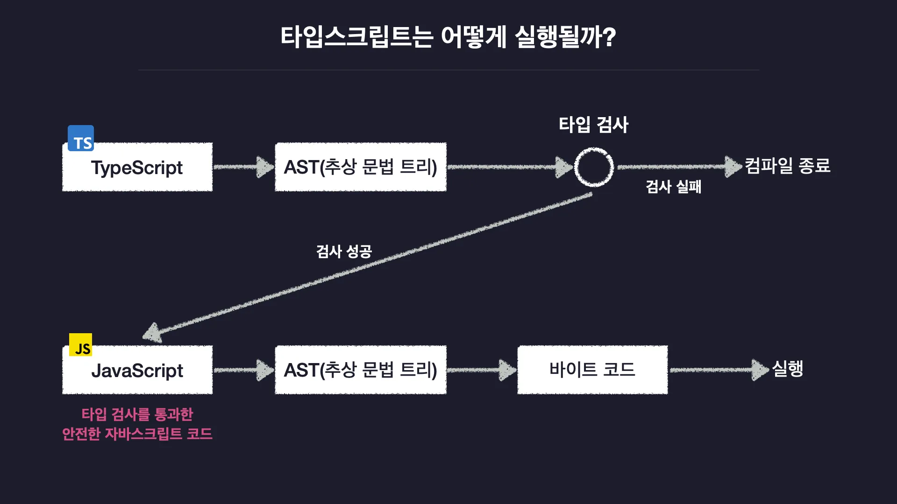

## Section1. 타입스크립트 개론

### TypeScript의 탄생 배경

> #### 타입스크립트 = 자바스크립트의 확장판

TypeScript란, 자바스크립트를 더 안전하게 사용할 수 있도록 `타입 관련 기능들을 추가한` 언어

- 자바스크립트는 변수의 타입을 직접 정의할 수 있는 방법이 없다.

- 근데 굳이 굳이 왜 타입스크립트를 써야하나. 자바스크립트가 너무 잘나가서?
  - 자바스크립트는 아주 쉽고 빠르고 간결하게 작성할 수 있는 것에 중점을 두고 만들어졌는데, node.js 가 등장함 (자바스크립트 런타임)
  - 이로 인해, 웹 브라우저에서만 사용할 수 있었던 게 어디서든 사용할 수 있게 됨. (다양한 프로그램들이 개발)
  - but, 자바스크립트가 너무 엄격하지 않음. 이 유연함이 버그를 발생시켜 안정성을 떨어뜨림
  - 이러한 문제를 극복하기 위해 안정성을 추가한 언어가 타입스크립트.

> 즉, 자바스크립트를 더 복잡한 상황에서 더 안정적으로 사용하기 위해 타입이라는 안정장치를 추가한 것이다.

<br/>

#### Type System

모든 프로그래밍 언어는 타입 시스템을 갖고 있는데, 이 타입 시스템은 `타입을 언제 결정`하느냐에 따라 크게 2가지로 나뉜다.

1. 정적 타입 시스템 (C, Java, ..)

   - 코드 실행 이전 모든 변수의 타입을 고정적으로 결정
   - but, 코드의 양이 넘 늘어남

2. 동적 타입 시스템 (Python, JavaScrsipt, ..)

   - 코드를 실행하고 나서 그때그때마다 유동적으로 결정
   - 변수의 타입이 하나로만 고정되지 않음, 유연함
   - but, 에러 발생 가능성

> #### 타입스크립트 = 동적 + 정적 타입 시스템

변수의 타입을 실행 전에 결정하고, 타입 오류를 실행 전에 검사하며 모든 변수에 타입을 일일이 지정할 필요가 없다.

-> 안전성, 불편함 해결!

-> 점진적 타입 시스템 (Gradual Type System)

<br/>

### TypeScript의 동작 원리와 이유

프로그래밍 언어의 동작 원리는 다음과 같다.

프로그래밍 언어를 컴파일하면 컴퓨터가 읽을 수 있는 기계어로 변환되어 실행됨

- 기본적인 컴파일 과정

  > JavaScript -> AST(추상 문법 트리) -> 바이트 코드 -> 실행

- 타입스크립트의 컴파일 과정

  > TypeScript -> AST(추상 문법 트리) -> Type Checking(타입 검사) 성공 시, -> 안전한 JavaScript 코드로 변환

  

<br/>

### @types/node 설치 & 실행하기

```bash
npm init  # node.js 패키지 초기화
npm i @types/node  # node.js 기능들의 타입 정보를 가지고 있는 패키지
sudo npm i -g typescript # 타입스크립트 컴파일러
sudo npm i -g tsx

> tsx src/index.ts # 실행
```

<br/>
