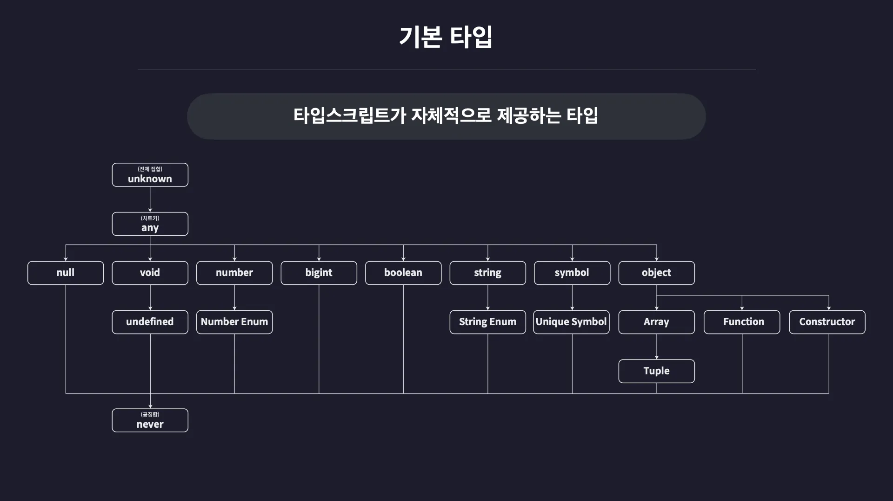

### 타입스크립트 컴파일러 옵션

> 타입스크립트의 컴파일 과정에서 얼마나 엄격하게 타입 오류를 검사할지 정하는 것

```bash
tsc --init # 컴파일러 옵션 자동 생성
```

### tsconjg.json 알아보기

```json
{
  "compilerOptions": {
    "target": "esnext",
    "module": "esnext",
    "outDir": "dist",
    "strict": true,
    "moduleDetection": "force"
  },
  "include": ["src"],
  "skipLibCheck": true
}
```

- `include 옵션`

  - tsc에게 컴파일 할 타입스크립트 파일의 범위와 위치를 알려주는 옵션

- `target 옵션`

  - 컴파일 결과 생성되는 자바스크립트 코드의 버전을 설정

- `module 옵션`

  - 자바스크립트 코드의 모듈 시스템을 설정

- `ourDir 옵션`

  - 컴파일 결과 생성할 자바스크립트 코드의 위치를 결정

- `ModuleDetection 옵션`

  - 모든 타입스크립트는 글로벌 모듈로 인식 -> 개별 모듈로 만들어줘야 함
  - 전역 모듈이 아닌 로컬(독립) 모듈로 취급되도록 만드는 것을 자동화 하는 옵션

- `strict 옵션`

  - 타입스크립트 컴파일러의 타입 검사 엄격함 수준을 정하는 옵션

- `"skipLibCheck": true`
  - 타입 정의 파일(.d.ts)의 타입 검사를 생략하는 옵션
  - 보통 타입 정의 파일은 라이브러리에서 사용하는데 가끔 라이브러리의 타입 정의 파일에서 타입 오류가 발생하는 일이 발생할 수 있습니다.
  - 따라서 해당 옵션을 true로 설정하셔서 불 필요한 타입 정의 파일의 타입 검사를 생략하도록 설정해주시기 바랍니다.

<br/>

## Section2. 타입스크립트 기본

### 기본 타입

타입스크립트가 자채적으로 제공하는 타입. 각각의 타입은 부모와 자식의 관계를 가짐



### 원시 타입과 리터럴 타입

#### 원시타입

> 하나의 값만 저장하는 타입

```ts
let num1: number = 123;
num1 = "hello"; // ❌

let str1: string = "hello";
let bool1: boolean = true;
let null1: null = null;
let unde1: undefined = undefined;
```

- number, string, boolean, null, undefined
- 변수의 이름 뒤에 콜론(:)과 함께 변수의 타입을 정의하는 이런 문법을 `타입 주석` 또는 `타입 어노테이션`

#### 리터럴타입

> 하나의 값만 포함하도록 값 자체로 만들어진 타입

```ts
let numA: 10 = 10;
let strA: "hello" = "hello";
let boolA: true = true;
let boolB: false = false;
```

<br/>
